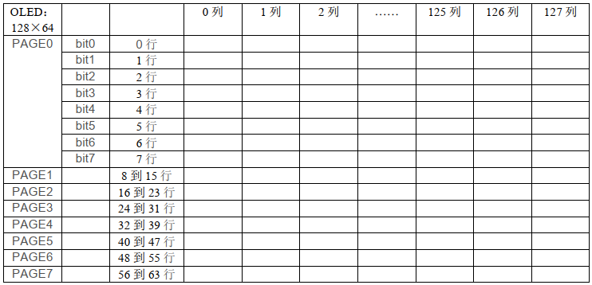
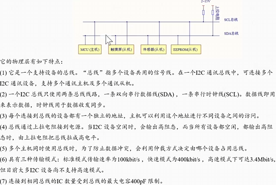
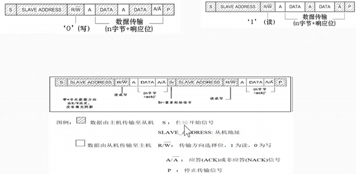
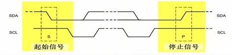

# 项目1：裸机版多功能桌面环境监测系统

# MFDEMS-Bare-Metal

这是裸机版多功能桌面环境监测系统的实现，旨在实践学习到的嵌入式知识。本项目是学习野火《7天入门STM32项目》的学习成果[视频源址](https://www.bilibili.com/video/BV1C4421Z7t8/?p=12&amp;share_source=copy_web&amp;vd_source=a076aeed245b265b10dbbccc281e7d1d)。文中图片和项目部分资料均来源于该视频。

## 结果展示

https://github.com/user-attachments/assets/01c243bb-c6ad-4281-b750-c4530ed327f5

## 程序功能

### 一级功能

1. 开机连续显示3张小猫图像--上下左右居中--总共持续1s；
2. 第一步过后显示主页；
3. 可通过板载按键key1、key2左右切换一级菜单。分别是主页、音乐、温湿度、灯具控制、木鱼；
4. 可通过扩展按键key3进入、退回一级菜单。分别是主页、音乐、温湿度、灯具控制、木鱼。

### 二级功能

1. 主页内容：招呼图；
2. 音乐内容：全屏位图；
3. 灯具内容：开关灯(LED4)；
4. 打坐内容：敲木鱼。使用板载按键key1、key2可以计数或清零敲击次数；
5. 温湿度内容：500ms更新一次温湿度数据。

## 功能实现

### 驱动部分

#### GPIO简介

本项目使用到GPIO的外接硬件部分有：外接LED灯、板载按键1、板载按键2、板载按键3、LED屏幕、DHT11温湿度传感器。

GPIO即通用输入输出，STM32F103C8T6具有多个端口：GPIOA、GPIOB、GPIOC等，每个端口具有多个引脚，PIN0-PIN15。GPIO引脚有多种工作模式，这种工作模式因连接的外设和要求的初始状态不同而有所差异。以下是本项目使用到的引脚及其配置。

|外设|GPIO端口|引脚|工作模式|时钟|
| :--------: | :--------: | :----: | :------------------------: | :----: |
|LED灯|B|13|​`GPIO_Mode_Out_PP`（复用推挽输出）|​`RCC_APB2Periph_GPIOB`|
|KEY1|A|0|​`GPIO_Mode_IN_FLOATING`（浮空输入）|​`RCC_APB2Periph_GPIOA`|
|KEY2|C|13|​`GPIO_Mode_IN_FLOATING`（浮空输入）|​`RCC_APB2Periph_GPIOC`|
|KEY3|B|5|​`GPIO_Mode_IPD`（下拉输入）|​`RCC_APB2Periph_GPIOB`|
|DHT11|B|12|初始为`GPIO_Mode_IPD`，运行过程中配置|​`RCC_APB2Periph_GPIOB`|
|IIC_SCL|B|6|||
|IIC_SDA|B|7|||
|USART_TX|A|9|​`GPIO_Mode_AF_PP`（复用推挽输出）||
|USART_RX|A|10|​`GPIO_Mode_IPU`（上拉输入）||

```C
/* 引脚工作模式 */
typedef enum
{ 
  /* 模拟输入（ADC采集） */
  GPIO_Mode_AIN = 0x0,
  /* 模拟输入：内部无上拉下拉电阻，引脚电平完全由外部电路决定，容易受到外部干扰 */
  GPIO_Mode_IN_FLOATING = 0x04,
  /* 下拉输入：内部下拉电阻，默认低电平，外部高电平有效 */
  GPIO_Mode_IPD = 0x28,
  /* 上拉输入：内部上拉电阻，默认高电平，外部低电平有效 */
  GPIO_Mode_IPU = 0x48,
  /* 开漏输出：只能输出低电平，高电平由外部上拉电阻拉高（IIC使用） */
  GPIO_Mode_Out_OD = 0x14,
  /* 推挽输出：能够强力驱动高低电平输出（LED灯） */
  GPIO_Mode_Out_PP = 0x10,
  /* 复用开漏输出：同开漏输出，但由硬件外设控制 */
  GPIO_Mode_AF_OD = 0x1C,
  /* 复用推挽输出：同推挽输出，但由硬件外设控制 */
  GPIO_Mode_AF_PP = 0x18
}GPIOMode_TypeDef;
```

#### LED灯

##### 宏定义

LED4为外接LED灯，其使用GPIOB端口的PIN5引脚。

```C
// LED4灯相关宏定义
#define LED4_GPIO_PORT          GPIOB                           /* GPIO端口 */
#define LED4_GPIO_CLK_PORT      RCC_APB2Periph_GPIOB            /* GPIO端口时钟 */
#define LED4_GPIO_PIN           GPIO_Pin_5                      /* 对应PIN脚 */
```

##### 初始化及灯状态操作

LED灯为低电平触发，即引脚输出低电平LED灯点亮，输出高电平灯灭。因此在引脚初始化时将初始状态置为高电平。并且设置引脚的工作模式为推挽输出`GPIO_Mode_Out_PP`。推挽输出能够同时提供强力的高电平和低电平，是一种驱动方式，与此常见的其他GPIO方式还有开漏输出（只有内部下拉，上拉需外部）等。

```C
// LED4GPIO引脚初始化
/* 开启 LED 相关的GPIO外设/端口时钟 */
RCC_APB2PeriphClockCmd(LED4_GPIO_CLK_PORT,ENABLE);
    
/* 初始化为高电平（灯灭） */
GPIO_SetBits(LED4_GPIO_PORT,LED4_GPIO_PIN);
    
/*选择要控制的GPIO引脚、设置GPIO模式为 推挽模式、设置GPIO速率为50MHz*/
gpio_initstruct.GPIO_Pin    = LED4_GPIO_PIN;
gpio_initstruct.GPIO_Mode   = GPIO_Mode_Out_PP;
gpio_initstruct.GPIO_Speed  = GPIO_Speed_50MHz;
GPIO_Init(LED4_GPIO_PORT,&gpio_initstruct);
```

此外还有一些对于灯状态的操作，如控制灯开、灯灭、翻转灯的状态。

低电平触发下，使用`GPIO_ResetBits(GPIOx,GPIO_Pin)`​来点灯（即置引脚高电平），使用`GPIO_SetBits(GPIOx,GPIO_Pin)`​来关灯（即置引脚低电平）。而翻转灯状态时直接操作了控制GPIO引脚的输出电平寄存器`ODR`​，通过异或操作实现翻转。ODR寄存器中的每一位对应一个GPIO引脚，通过`GPIO_Pin`掩码（对应引脚位置1）来保证只影响相关引脚，通过异或来翻转对应引脚状态。

```C
void LED_TOGGLE(GPIO_TypeDef* GPIOx, uint16_t GPIO_Pin)
{
    GPIOx->ODR ^= GPIO_Pin;  // 直接操作输出数据寄存器进行位异或
}
```

#### 按键KEY

##### 宏定义与中断说明

KEY1使用GPIOA端口PIN0引脚；KEY2使用GPIOC端口PIN13引脚。两者均使用按键中断进行状态检查。KEY3使用GPIOB端口PIN15引脚，非中断，在任务轮询中直接检查引脚状态来判断。

###### 关于按键中断

1. 按键一端与相关引脚相连，另一端接地（低电平有效）。没按下时相关引脚被内部上拉到高电平，按下瞬间引脚被拉低，出现一个下降沿；
2. 开启GPIO时钟之后将给GPIO相关模块供电，后续配置才会有效。配置引脚工作模式为浮空输入，即纯粹做输入；
3. 开启AFIO时钟，给引脚到EXTI（外部中断线）供电，后续配置AFIO寄存器才会有效；
4. 将相关引脚挂到外部中断线上；
5. 配置EXTI：配置相关外部中断线，将其设置为中断模式、下降沿触发并使能。此时硬件电路已经就绪，当按键引脚出现下降沿时，相关外部中断线EXTI将挂起中断标志位；
6. 配置NVIC，将相关的外部中断的抢占优先级、子优先级写入NVIC，并使能该通道。此时外部中断线一旦挂起标志位，NVIC就会去向量表里找入口函数；
7. 实现中断服务函数。首先通过宏定义`#define KEY1_EXTI_IRQHANDLER EXTI0_IRQHandler`​为真正的中断向量入口起了一个别名。启动文件中已经将中断处理函数`EXTI0_IRQHandler和EXTI0_IRQHandler`​硬编码进了向量表，在C文件中实现同名函数即可，这里为方便记忆使用`KEY1_EXTI_IRQHANDLER`，链接器在最终链接阶段自动将其地址填到向量表对应的位置中去。

EXTI外部中断线与引脚编号一一对应，即同一端口的不同引脚不能共享一条EXTI线，而不同端口的同一引脚可共享一条EXTI线，可在中断函数中通过读取引脚来区分。

```C
//KEY1
#define KEY1_GPIO_PORT          GPIOA                           /* GPIO端口 */
#define KEY1_GPIO_CLK_PORT      RCC_APB2Periph_GPIOA            /* GPIO端口时钟 */
#define KEY1_GPIO_PIN           GPIO_Pin_0                      /* 对应PIN脚 */

#define KEY1_EXTI_PORTSOURCE    GPIO_PortSourceGPIOA            /* 中断端口源 */
#define KEY1_EXTI_PINSOURCE     GPIO_PinSource0                 /* 中断PIN源 */
#define KEY1_EXTI_LINE          EXTI_Line0                      /* 中断线 */
#define KEY1_EXTI_IRQ           EXTI0_IRQn                      /* 外部中断向量号 */
#define KEY1_EXTI_IRQHANDLER    EXTI0_IRQHandler                /* 中断处理函数 */

//KEY2
#define KEY2_GPIO_PORT          GPIOC                           /* GPIO端口 */
#define KEY2_GPIO_CLK_PORT      RCC_APB2Periph_GPIOC            /* GPIO端口时钟 */
#define KEY2_GPIO_PIN           GPIO_Pin_13                     /* 对应PIN脚 */

#define KEY2_EXTI_PORTSOURCE    GPIO_PortSourceGPIOC            /* 中断端口源 */
#define KEY2_EXTI_PINSOURCE     GPIO_PinSource13                /* 中断PIN源 */
#define KEY2_EXTI_LINE          EXTI_Line13                     /* 中断线 */
#define KEY2_EXTI_IRQ           EXTI15_10_IRQn                  /* 外部中断向量号 */
#define KEY2_EXTI_IRQHANDLER    EXTI15_10_IRQHandler            /* 中断处理函数 */

//KEY3
#define KEY3_GPIO_PORT          GPIOB                           /* GPIO端口 */
#define KEY3_GPIO_CLK_PORT      RCC_APB2Periph_GPIOB            /* GPIO端口时钟 */
#define KEY3_GPIO_PIN           GPIO_Pin_15 
```

##### 数据结构设计

为方便统一管理按键，设计按键结构体，将与按键有关的所有元素统一管理。其中包含的其他数据结构定义详见代码部分`user/key/bsp_gpio_key.h`。

```C
/* 按键的结构体 */
typedef struct
{
    GPIO_TypeDef*       GPIOx;          /* 按键对应的GPIO端口 */
    uint16_t            GPIO_Pin;       /* 按键对应的GPIO引脚 */
    KEY_TriggerLevel    triggerlevel;   /* 按键对应的触发电平 */
    KEY_Status          status;         /* 按键的状态 */
    uint64_t            press_time;     /* 按键按下的时间 */
    uint64_t            release_time;   /* 按键释放的时间 */
    KEY_Event           event;          /* 按键的事件类型 */
    KEY_ClickType       clicktype;      /* 按键的点击类型 */
}KEY_Info;

extern KEY_Info key1_info;
extern KEY_Info key2_info;
```

##### GPIO配置（以按键1为例）

```C
/* 按键GPIO配置 */
void KEY_GPIO_Config(void)
{
    GPIO_InitTypeDef gpio_initstruct = {0};                 /* 按键GPIO结构体 */

    RCC_APB2PeriphClockCmd(KEY1_GPIO_CLK_PORT,ENABLE);      /* 开启KEY1相关的GPIO外设/端口时钟 */    
    GPIO_SetBits(KEY1_GPIO_PORT,KEY1_GPIO_PIN);             /* 按键为低电平触发，这里初始化为高电平 */    
    gpio_initstruct.GPIO_Pin    = KEY1_GPIO_PIN;
    gpio_initstruct.GPIO_Mode   = GPIO_Mode_IN_FLOATING;
    gpio_initstruct.GPIO_Speed  = GPIO_Speed_50MHz;
    GPIO_Init(KEY1_GPIO_PORT,&gpio_initstruct);
}
```

##### 外部中断线配置（以按键1为例）

```C
/* 外部中断线配置（GPIO>EXTI） */
void KEY_Mode_Config(void)
{
    EXTI_InitTypeDef exti_initstruct = {0};                         /* 定义一个 EXTI 初始化结构体 */
    RCC_APB2PeriphClockCmd(RCC_APB2Periph_AFIO,ENABLE);             /* 开启 AFIO 相关的时钟 */

    GPIO_EXTILineConfig(KEY1_EXTI_PORTSOURCE, KEY1_EXTI_PINSOURCE); /* 选择中断信号源，将KEY1的引脚映射到EXTI0 */
    exti_initstruct.EXTI_Line       = EXTI_Line0;                   /* 选择中断LINE */
    exti_initstruct.EXTI_Mode       = EXTI_Mode_Interrupt;          /* 选择中断模式*/
    exti_initstruct.EXTI_Trigger    = EXTI_Trigger_Falling;         /* 选择触发方式*/
    exti_initstruct.EXTI_LineCmd    = ENABLE;                       /* 使能中断*/
    EXTI_Init(&exti_initstruct);
}
```

##### 配置NVIC（以按键1为例）

```C
/* 配置NVIC中断，中断优先级和中断通道 */
void KEY_NVIC_Config(void)
{
    NVIC_InitTypeDef nvic_initstruct = {0};                                 /* 定义一个 NVIC 结构体 */

    RCC_APB2PeriphClockCmd(RCC_APB2Periph_AFIO,ENABLE);                     /* 开启 AFIO 相关的时钟 */

    nvic_initstruct.NVIC_IRQChannel                     = KEY1_EXTI_IRQ;    /* 配置中断源 */
    nvic_initstruct.NVIC_IRQChannelPreemptionPriority   =  1;               /* 配置抢占优先级 */
    nvic_initstruct.NVIC_IRQChannelSubPriority          =  0;               /* 配置子优先级 */
    nvic_initstruct.NVIC_IRQChannelCmd                  =  ENABLE;          /* 使能配置中断通道 */
    NVIC_Init(&nvic_initstruct);
}
```

##### 中断服务例程（以按键1为例）

```C
void KEY1_EXTI_IRQHANDLER(void)
{
    if(EXTI_GetFlagStatus(KEY1_EXTI_LINE) == SET)
    {
        left_shift_flag = 1; /* 标记左移 */
        menu_show_flag = 1;  /* 标记显示菜单 */
        EXTI_ClearITPendingBit(KEY1_EXTI_LINE); /* 清除中断标志位 */
    }
}
```

#### 温湿度传感器DHT11

DHT11为温湿度传感器，共4个引脚，是单线双向通信机制，即只使用一根数据线进行数据交换和控制。

数据格式为：8bit湿度整数数据+8bit湿度小数数据+8bit温度整数数据+8bit温度小数数据+8bit校验和数据。其中，湿度小数部分为0；当温度低于0℃时，温度数据的低8位的最高位为1。

数据传送正确时，校验和等于四字节数据之和。

通信时序为：建立连接、数据接收两部分。

|引脚|作用|备注|
| :-----------------: | :-------------------: | :---------------: |
|VDD|电源||
|DATA|输出串行总线|连接到GPIOB12|
|NC|空脚||
|GND|接地||

##### 建立连接

1. DHT11上电后需等待1s才会稳定，在此期间不能发送任何指令，数据线SDA通过上拉电阻一直保持高电平状态。
2. 主机GPIO引脚设置为输出状态，拉低数据线SDA18ms以上，然后主机GPIO引脚设置为输入状态，释放数据线SDA，由于上拉电阻，数据线进入高电平状态；
3. 从机DHT11接收到起始信号后，先拉低数据线SDA（83us）作为应答信号，再拉高数据线SDA（87us）表示连接建立成功，通知主机准备接收数据；
4. 从机开始发送数据：从机发送40位数据，每位数据都以54us的低电平开始，主机通过判断低电平后的高电平时间来决定接收1还是0：

    1. “0”：54us的低电平和23~27us的高电平；
    2. “1”：54us的低电平和68~74us的高电平。

最后一位数据发送结束后，从机拉低数据线SDA54us，随后从机释放数据线SDA，数据线SDA进入空闲状态，由于上拉电阻，此时数据线SDA为高电平状态。

##### 宏定义

这里使用GPIOB12作为DHT11的数据总线，与其相连，进行数据传输。

```C
/* DHT11_DATA 引脚配置 */
#define DHT11_DATA_GPIO_PORT          GPIOB                           /* GPIO端口 */
#define DHT11_DATA_GPIO_CLK_PORT      RCC_APB2Periph_GPIOB            /* GPIO端口时钟 */
#define DHT11_DATA_GPIO_PIN           GPIO_Pin_12                     /* 对应PIN脚 */

#define DHT11_DATA_IN()         GPIO_ReadInputDataBit(DHT11_DATA_GPIO_PORT,DHT11_DATA_GPIO_PIN)
#define DHT11_DATA_OUT(VALUE)   if(VALUE)   GPIO_SetBits(DHT11_DATA_GPIO_PORT,DHT11_DATA_GPIO_PIN);\
                                else      GPIO_ResetBits(DHT11_DATA_GPIO_PORT,DHT11_DATA_GPIO_PIN)
```

##### 数据结构与函数声明

- 由于在进行数据传输时PB12需要既作为输入（接收来自DHT11的数据）、又作为输出（主机需主动拉低数据线以发送起始信号），因此需要实时改变引脚工作模式，使用函数`DHT11_DataPinModeConfig()`来进行模式切换。

- 函数`DHT11_ReadByte()`则负责读取1字节数据；

- 函数`DHT11_ReadData()`负责读取一帧数据，即完整的温湿度数据，并将其存储在指定缓冲区中。

```C
typedef struct
{                            
   uint8_t humi_int;        // 湿度的整数部分
   uint8_t humi_deci;       // 湿度的小数部分
   uint8_t temp_int;        // 温度的整数部分
   uint8_t temp_deci;       // 温度的小数部分
   uint8_t check_sum;       // 校验和                              
}DHT11_DATA_TYPEDEF;
                   
void DHT11_GPIO_Config(void);
void DHT11_DataPinModeConfig(GPIOMode_TypeDef mode);
uint8_t DHT11_ReadByte(void);
ErrorStatus DHT11_ReadData(DHT11_DATA_TYPEDEF *dht11_data);
```

##### 函数实现

这里仅对主要的字节读取函数`DHT11_ReadByte()`​和帧读取函数`DHT11_ReadData()`进行说明。

###### 帧读取`DHT11_ReadData()`

该函数负责读取一个完整数据帧（40字节数据）和前期的连接建立。具体过程见代码注释。

```C
/**
 * @brief  一次完整的数据传输为40bit，高位先出,
 * @param  dht11_data:数据接收区
 * @note   8bit 湿度整数 + 8bit 湿度小数 + 8bit 温度整数 + 8bit 温度小数 + 8bit 校验和(每次读出的温湿度数值是上一次测量的结果，欲获取实时数据,需连续读取2次，但不建议连续多次读取传感器，每次读取传感器间隔大于2秒即可获得准确的数据。)
 * @retval ERROR：失败，SUCCESS：成功
 */
ErrorStatus DHT11_ReadData(DHT11_DATA_TYPEDEF *dht11_data)
{
    uint8_t count_timer_temp = 0;
    
    /* 步骤1：主机设置输出状态，拉低数据线18ms以上，然后设置为输入模式，释放数据线 */
    DHT11_DataPinModeConfig(GPIO_Mode_Out_OD); /* 配置为开漏输出模式，由外部上拉电阻拉高电平 */
    DHT11_DATA_OUT(0); /* 拉低数据总线（SDA）*/
    DWT_DelayMs(20); /* 阻塞等待20ms（确保DHT11能检测到起始信号）*/
    DHT11_DATA_OUT(1); /* 释放数据总线（SDA）*/
    DHT11_DataPinModeConfig(GPIO_Mode_IPU); /* 配置为上拉输入模式，由外部上拉电阻拉高电平 */
    DWT_DelayUs(20);//等待上拉生效且回应,主机发送开始信号结束后,延时等待20-40us后

    /* 步骤2：从机接收到起始信号后，先拉低数据线83us以上，然后拉高数据线87us以上 */
    /* 通过读取数据总线（SDA）的电平，判断从机是否有低电平响应信号 如不响应则跳出，响应则向下运行*/
    if(DHT11_DATA_IN()== Bit_RESET)
    {
        /* 低电平信号 */
        count_timer_temp = 0;
        /* 轮询检测DHT11发出的低电平信号的持续时间，由于之前等待上拉延时了20us，
           因此这里计数值应该不到83就会直接跳出 */
        while(DHT11_DATA_IN() == Bit_RESET)
        {
            if(count_timer_temp++ >83)
            {
                return ERROR;
            }  
            DWT_DelayUs(1);
        }
                
        /* 高电平信号 */
        count_timer_temp = 0;
        /* 轮询检测DHT11发出的高电平信号的持续时间（87us） */
        while(DHT11_DATA_IN() == Bit_SET)
        {
            if(count_timer_temp++ >87)
            {
                return ERROR;
            }  
            DWT_DelayUs(1);
        }
        
        /* 应答信号接收成功并且已建立连接，数据接收：连续读取40字节 */
        dht11_data->humi_int  = DHT11_ReadByte();        //湿度高8位
        dht11_data->humi_deci = DHT11_ReadByte();        //湿度低8位
        dht11_data->temp_int  = DHT11_ReadByte();        //温度高8位
        dht11_data->temp_deci = DHT11_ReadByte();        //温度低8位
        dht11_data->check_sum = DHT11_ReadByte();        //校验和
        
        /* 最后一位数据发送后，从机将拉低数据总线SDA54us，随后从机释放总线 */
        DWT_DelayUs(54);
        
        /* 校验和：加和前4个字节数据，校验和字节为加和结果的低8位 */
        if(dht11_data->check_sum == dht11_data->humi_int+dht11_data->humi_deci+dht11_data->temp_int+dht11_data->temp_deci)
        {
            return SUCCESS;
        }
        else
        {
            return ERROR;
        }
    }
    else
    {
        return ERROR;
    }
}
```

###### 字节读取`DHT11_ReadByte()`

该函数用于在主机与DHT11建立连接之后读取数据字节。

```C
/* 读取1个字节，即8bit */
uint8_t DHT11_ReadByte(void)
{
    uint8_t dht11_readbyte_temp = 0;
    
    for(uint8_t i = 0;i<8;i++)
    {
        /*  从机发送数据：每位数据以54us低电平标置开始，
            高电平持续时间为23~27us表示“1”，
            高电平持续时间为68~74us表示“0” */

        // DWT_Delay_Us(54); /* 延时54us，这里起始无需精确延时，直接在while循环中延时即可 */
        while(DHT11_DATA_IN() == Bit_RESET); /* 继续延时，直到高电平出现 */        
        
        /* 高电平出现之后延时40us，如果仍为高电平表示数据“1”，如果为低电平表示数据“0” */
        /* 理解：如果是“1”，则40us之后仍旧是高电平，如果是“0”，则40us之后为低电平（进入下一位的接收） */
        DWT_DelayUs(40);
        
        if(DHT11_DATA_IN() == Bit_SET) /* 高电平：“1” */
        {
            while(DHT11_DATA_IN() == Bit_SET);
            dht11_readbyte_temp |=(uint8_t)(0x1<<(7-i)); /* 把位7-i位置1，MSB先行（字节高位先发送） */
        }
        else  /* 低电平：“0” */
        {
            dht11_readbyte_temp &=(uint8_t)(~(0x1<<(7-i))) ; /* 把位7-i位清0，MSB先行 */
        }
    }
    return dht11_readbyte_temp;
}
```

#### OLED

##### 模块简介

0.96寸IIC OLED模块，屏幕分辨率为128 * 64像素，黄蓝双色显示，驱动芯片为SSD1306，使用IIC接口，用于显示字符、图片等信息。

显存大小：GDDRAM = 128 * 64 bit SRAM；工作电压：3.3V。

该模块共4根引脚，分别为VCC、GND、SCL、SDA。其中SCL和SDA分别为IIC通信中的时钟总线和数据总线。

##### 显示逻辑

该模块每次最小显示单位为1个字节，即8位，为1页（PAGE），且竖向排列。如下图中标出的bit0-bit7。也就是说在列上没有写入限制，即可单独设置一列，但在行上有限制，即最小设置为8行，即一个PAGE。因此，128*64的显示区域分为8个PAGE，每个PAGE128列。屏幕左上角为坐标原点，X轴水平向右，Y轴垂直向下。

此外该模块共有3种写方式：

1. 页寻址模式：写完当前列的8位之后，列地址自动加一，但不会自动换页；
2. 水平寻址模式：可自动换页，如PAGE0的第128列写完之后地址指针自动移到PAGE1的第1列（COL0）；
3. 垂直寻址模式：写完一列之后换下一列，如PAGE7的第1列写完之后地址指针移动到PAGE0的第2列。

OLED在串行模式（数据在单数据线上逐位发送）下只能写入数据和命令，无法读取数据。



##### 通信时序

该模块采用IIC通信，关于IIC的具体实现，请到相关章节阅读。

1. 主机发送起始信号（S）；
2. 从机确认7位从机地址和1位读写选择（0表示写模式，1表示读模式）；
3. 从机应答信号（ACK）；
4. 主机发送控制字节：字节中的位7表示模式选择，置1表示后续的每个数据字节前都有一个控制字节，置0表示只有一次控制字节，后续都是数据字节；位6表示数据指令选择，置1表示写入的是数据，置0表示写入的是指令；位5-位0无实际意义，通常置0。

    ​`0x00`即表示控制字节：位7为0表示只有一次控制字节，位6为0表示是指令；

    ​`0x40`即表示控制字节：位7为0表示只有一次控制字节，位6为1表示是数据。
5. 从机应答信号（ACK）；
6. 主机发送数据或指令；
7. 从机应答信号（ACK）；
8. 主机发送终止信号（P）。

##### 实现过程

###### 通信以及数据传输

OLED屏幕的通信是建立在IIC通信基础上的，通过IIC发送控制命令和数据以及显示数据等来实现屏幕配置和显示。

这里仅详细说明重要的几个过程实现。

IIC上的设备必须有自己的地址，这里OLED地址为`#define OLED_SLAVER_ARRD (0x3c)`​。此外，上述通信时序说明控制字节具有多种配置，这里对于控制字节我们选择每次仅发送1次控制字节，即位7总为0，则按照位6的不同，可以得到两种控制字节：指令模式（`#define OLED_WR_DATA (0x40)`​）和数据模式（`#define OLED_WR_CMD (0x00)`）。

按照发送数据的需求，有两个粒度不同的函数：`OLED_WriteByte()`​和`OLED_WriteBuffer()`。前者多用于进行OLED模式配置，后者用于显示数据的批量发送。

1. ​`OLED_WriteByte()`函数。从代码可以看出，在连接建立时间内，其仅传输两个数据，第一个控制字节，第二个为具体数据，之后便让出了总线。

    ```C
    /* 向OLED 单指令/数据（1字节）写入操作 */
    ErrorStatus OLED_WriteByte(uint8_t cmd,uint8_t byte)
    {  
        ErrorStatus temp = ERROR;
        /* 检测总线是否繁忙和发出开始信号*/
        temp = IIC_Start();
        if(temp != SUCCESS) return temp;

        /* 呼叫从机,地址配对*/
        temp = IIC_AddressMatching(OLED_SLAVER_ARRD,IIC_WRITE);
        if(temp != SUCCESS)
        {
            printf("地址失败");
            /* 释放总线并发出停止信号 */
            IIC_Stop();
            return temp;
        }
        
        /* 写指令/数据*/
        temp = IIC_SendData(cmd);
        if(temp != SUCCESS)
        {
            printf("写指令/数据失败");
            /* 释放总线并发出停止信号 */
            IIC_Stop();
            return temp;
        }
        
        /* 具体指令/数据*/
        temp = IIC_SendData(byte);
        if(temp != SUCCESS)
        {
            printf("具体指令/数据失败");
            /* 释放总线并发出停止信号 */
            IIC_Stop();
            return temp;
        }
        
        /* 释放总线并发出停止信号 */
        IIC_Stop();
        return SUCCESS;  
    }
    ```
2. ​`OLED_WriteBuffer()`​函数。和前者不同，在发送完第一个控制字节之后，发送了由`buffer`给出的批量数据，最后才让出了总线。

    ```C
    /* 向OLED 多指令/数据（1字节）写入操作 */
    ErrorStatus OLED_WriteBuffer(uint8_t cmd,uint8_t* buffer,uint32_t num)
    {  
        ErrorStatus temp = ERROR;

        /* 检测总线是否繁忙和发出开始信号*/
        temp = IIC_Start();
        if(temp != SUCCESS) return temp;

        /* 呼叫从机,地址配对*/
        temp = IIC_AddressMatching(OLED_SLAVER_ARRD,IIC_WRITE);
        if(temp != SUCCESS)
        {
            printf("地址失败");
            /* 释放总线并发出停止信号 */
            IIC_Stop();
            return temp;
        }
        
        /* 写指令/数据*/
        temp = IIC_SendData(cmd);
        if(temp != SUCCESS)
        {
            printf("写指令/数据失败");
            /* 释放总线并发出停止信号 */
            IIC_Stop();
            return temp;
        }
     
        /* 具体指令/数据 */
        for(uint32_t i = 0;i<num;i++)
        {
            temp = IIC_SendData(*buffer++);
            if(temp != SUCCESS)
            {
                printf("具体指令/数据失败");
                return ERROR;
            }
        }
        
        /* 释放总线并发出停止信号 */
        IIC_Stop();
        return SUCCESS;  
    }
    ```

###### 显示中文

中文由16*16大小的点阵表示，关于制作过程请见应用部分。在行显示方面，由于1个PAGE占据8行，且一次最小写入的行数为8，即一个PAGE，因此一个汉字需要两个PAGE进行显示。而列上则无此限制。

中文对应的点阵存储在指定的数组字库之中，显示时通过指定汉字在字库中的位置来获取其对应的16*16点阵数据。

中文相关的函数为：`OLED_ShowChinese()`​和`OLED_ShowChinese_F16*16()`。

​`OLED_ShowChinese()`，向指定的行（y）和列（x）填入指定的数据。在填入之前需要先移动OLED的地址指针到指定位置。然后再开始填充数据。

​`OLED_ShowChinese_F16X16()`是前者的封装，指定行（共4行）列（共8列）填入指定汉字。

```C
/**
  * @brief  设置光标
  * @param  y：光标y位置以左上角为原点，向下方向的坐标，范围：0~7
  *         x：光标x位置以左上角为原点，向右方向的坐标，范围：0~127
  * @retval 无
  */
void OLED_SetPos(uint8_t y,uint8_t x) //设置起始点像素点坐标
{ 
    /* {设置Y位置,设置X位置高4位,设置X位置低4位} */
    uint8_t data_buffer_temp[] =  {0xB0+y,((x&0xF0)>>4)|0x10,(x&0x0F)|0x00};
    OLED_WriteBuffer(OLED_WR_CMD,data_buffer_temp,OLED_ARRAY_SIZE(data_buffer_temp));
}
```

```C
/**
  * @brief  OLED_ShowCN，显示的汉字,16*16点阵
  * @param  y：以左上角为原点，向下方向的坐标，范围：0~7   (每次操作8个像素点)
  *         x：以左上角为原点，向右方向的坐标，范围：0~127 (每次操作1个像素点)
  *         n:汉字在的索引
  *         data_cn 中文LIB
  * @retval 无
  */
void OLED_ShowChinese(uint8_t y,uint8_t x,uint8_t n,uint8_t *data_cn)
{
    /* 一个汉字32个字节：32字节=32*8=256bit，16*16=256 */
    uint32_t addr=32*n;
    
    /* 填充上半部分 */
    OLED_SetPos(y,x);
    OLED_WriteBuffer(OLED_WR_DATA,data_cn+addr,16);
    
    /* 填充下半部分（下一PAGE） */
    OLED_SetPos(y+1,x);
    OLED_WriteBuffer(OLED_WR_DATA,data_cn+addr+16,16);
}
```

```C
/* 向指定行（共4行）和列（共8列）显示一个汉字（大小为F16X16） */
void OLED_ShowChinese_F16X16(uint8_t line, uint8_t offset,uint8_t n)
{
    OLED_ShowChinese(line*TEXTSIZE_F16X16/8,offset*TEXTSIZE_F16X16, n,(uint8_t *)chinese_library_16x16);
}
```

###### 显示英文

英文字符仅显示ASCII码中的可打印部分（0x20-0x7E），包含了完整的英文字母（大小写）、数字0-9和常用的标点符号和特殊符号。

英文字符的显示和中文类似，不同之处在于英文字符的大小不同。设计中英文字符使用两种大小的点阵：6x8和8x16。实际使用8x16大小，即一个英文字符占据8列16行。

英文相关的函数为：`OLED_ShowChar()`​：负责依据指定的行列以及大小显示一个英文字符；`OLED_ShowString()`​：负责依据指定的起始行列以及大小显示一个英文字符串；`OLED_ShowString_F8X16()`：负责依据指定的起始行（4行）列（16列）显示大小为8x16的英文字符串。

```C
/**
  * @brief  OLED显示一个英文字符
  * @param  y：以左上角为原点，向下方向的坐标，范围：0~7   (每次操作8个像素点)
  *         x：以左上角为原点，向右方向的坐标，范围：0~127 (每次操作1个像素点)
  *         char_data 要显示的一个字符，范围：ASCII可见字符
  *         textsize : 字符字体大小
  * @retval 无
  */
void OLED_ShowChar(uint8_t y, uint8_t x, uint8_t char_data,uint8_t textsize)
{
    /* 使用字符对应的ASCII码值-32（首个显示字符的偏移量），得到字符在数组中的索引 */
    uint32_t addr = char_data - 32;
    
    // 先设置显示位置
    OLED_SetPos(y, x);
    
    switch(textsize)
    {
        case TEXTSIZE_F6X8:
            // 一次性发送6字节字体数据
            OLED_WriteBuffer(OLED_WR_DATA, (uint8_t*)ascll_code_6x8[addr], 6);
            break;
            
        case TEXTSIZE_F8X16:
            // 上半部分8字节
            OLED_WriteBuffer(OLED_WR_DATA, (uint8_t*)ascll_code_8x16[addr], 8);
            // 设置下半部分位置
            OLED_SetPos(y+1, x);
            // 下半部分8字节
            OLED_WriteBuffer(OLED_WR_DATA, (uint8_t*)ascll_code_8x16[addr] + 8, 8);
            break;
            
        default:
            break;
    }
}
```

###### 显示位图

位图显示和字符显示一致，不同之处在于数组和屏幕更加对应，只需给定起始绘制位置以及绘制区域的长宽即可。此外还要进行一些边界检查和对齐。具体地，由于写入行是按PAGE（一次8行）进行的，因此写入起始点的y坐标和宽度不能够出现非整PAGE的情况，如果出现则需要进行裁剪。具体情况在代码注释中进行了详细说明。

```C
/**
  * @brief  OLED_DrawBMP，显示BMP位图
  * @param  x,y: 起始点坐标(x:0~127, y:0~63)		
  * @param  x_length,y_length: 图片长宽用像素点表示	
  * @param  raw: 图片源数组	
  * @retval 无
  */
void OLED_DrawBitMap(uint8_t x,uint8_t y,uint8_t x_length,uint8_t y_length,uint8_t *raw)
{  
    uint32_t j=0;                   /* 遍历图片源数组的索引 */
    uint8_t y_page_start;           /* 起始PAGE */
    uint8_t x_col_start,x_col_end;  /* 起始列，结束列 */
    uint32_t raw_size=0;            /* 图片大小（像素数量） */
    
    /*寻找针对首行合适的page进行开始*/
    if((y+1)%8 !=0 && y != 0 )
    {
        /* 非首行显示且显示行需要落到下一个PAGE */
        y = (y/8+1)*8;
    }
    y_page_start =  y/8;
    x_col_start  =  x;
    
    /* 显示范围越界检查 */
    if(y_page_start>7 || x_col_start>127 || y_length>64 || x_length>128)
    {
       return;
    }
    
    /* 计算实际page数 */
    if(y_length%8 != 0)
    {
        /* 长度不能整PAGE显示，剩余内容需要落到下一个PAGE */
        y_length = y_length/8+1; 
    }
    else
    {
        y_length = y_length/8; 
    }
    
    /* 裁剪出范围内的page数 */
    if(y_page_start+y_length>8)
    {
        /* 计算位图最后落到哪个PAGE，如果越界则裁剪到最后一个PAGE */
        y_length = 8-y_page_start;
    }
    
    /* 裁剪出范围内的列数 */
    if(x_col_start+x_length>128)
    {
        x_length = 128-x_col_start;
    }
    
    /* 计算总的像素点 */
    raw_size = x_length * y_length; 
    
    if(raw_size >= 1024)
    {
        raw_size =  1024; 
    }
    
    /* 列的结束 */
    x_col_end = x_col_start+x_length;
    
    for(uint8_t y_temp=y_page_start;;y_temp++)
    {
        OLED_SetPos(y_temp,x_col_start);
        
        for(uint8_t x_temp = x_col_start;x_temp<x_col_end;x_temp++)
        {
            OLED_WriteByte(OLED_WR_DATA,(uint8_t)raw[j++]);
            if(j == raw_size) /* 所有数据已经加载完，跳出循环 */
            {
                return;
            }
        }
    }
}
```

#### IIC实现

IIC通讯协议（Inter-Intergrated Circuit）是由Philips公司开发的，由于其共两个引脚，硬件实现简单，可扩展性强，不需要USART、CAN等通讯协议的外部收发设备，现被广泛地使用在系统内多个集成电路间的通讯。

##### IIC物理层



##### IIC协议层

###### 基本读写过程

1. 主机：传输开始信号S；
2. 主机：S紧跟地址SLAVE ADDRESS；地址后为RW信号，即读写信号，0表示写、1表示读；
3. 从机：应答信号；
4. 此后每个数据被从机接收均会向主机发送应答信号；
5. 发送停止信号P之后再想发送数据都需要地址验证。

在S和P之间的数据无需地址验证，因为为了保证从机接收到有效数据，总线上的其他从机在此期间不能占据总线，不能向总线发送数据；阴影部分是由发送方发出的数据，非阴影部分则是由接收方发送出的数据；谁接收到数据谁发送应答信号；无论是读还是写、起始信号、地址、读写信号以及停止信号均是由主机（发起方）控制。



###### 通讯的起始和停止信号

1. IIC使用SDA信号线来传输数据，使用SCL信号线进行数据同步，即时钟线。SDA在SCL的每个时钟周期传输一位数据（高电平>低电平为一个时钟周期）。传输时，SCL为高电平时SDA表示的数据有效，即此时如果SDA为高电平则表示传输1，为低电平则表示传输0。当SCL为低电平时，SDA传输的数据无效，一般在这个时候SDA进行电平切换，为下一次表示数据做准备。
2. 上述过程并没有出现在SCL为高电平时SDA进行电平切换的情况，这种情况用于起始和停止信号表示。具体，当SCL为高电平时候，如果SDA出现一个下降沿则表示起始信号；出现一个上升沿则表示停止信号。

    

###### 地址以及数据方向

1. IIC总线上的每个设备都有自己的独立地址（即地址不能重复），主机发起通讯时，通过SDA发送设备地址来查找从机。IIC规定设备地址可以是7位或10位，实际中7位地址使用更广泛。紧跟设备地址的一个数据位用来表示数据传输方向，1表示主机由从机读数据，0表示主机往从机写数据；
2. 读数据方向时，主机会释放对SDA的控制，由从机控制SDA，主机接收数据；写数据时，SDA由主机控制，从机接收数据；
3. 地址以及读写信号发出后，会产生一个ACK信号，该信号很关键，正常情况下应当由目标地址的从机设备发出，且该信号具有时效性。如果超过一个时钟周期（SCL由高电平变为低电平）还未应答，此时将回非应答信号（由上拉电阻返回非应答信号的高电平）。

###### 响应

1. IIC的数据和地址传输都带响应，即应答信号和非应答信号；
2. 作为数据接收端，当设备接收到IIC传输的一个字节数据（地址+读写位）后，若希望对方继续发送数据，则需要向对方发送应答信号，发送方会继续发送下一个数据；如果希望结束数据传输，则向对方发送非应答信号；
3. 传输时主机产生时钟，在第9个时钟周期，数据发送端释放SDA的控制权，由数据接收端控制SDA，若SDA为高电平表示为非应答信号，若为低电平则为应答信号。

##### 软仿实现

###### 宏定义以及相关数据结构

具体解释详见代码注释：

```C
/*SCL时钟总线使用GPIOB6引脚*/
#define SOFT_IIC_SCL_GPIO_PORT    			    GPIOB			                /* 对应GPIO端口 */
#define SOFT_IIC_SCL_GPIO_CLK_PORT 	            RCC_APB2Periph_GPIOB			/* 对应GPIO端口时钟位 */
#define SOFT_IIC_SCL_GPIO_PIN			        GPIO_Pin_6	       				/* 对应PIN脚 */

/*SDA数据总线使用GPIOB7引脚*/
#define SOFT_IIC_SDA_GPIO_PORT    			    GPIOB       	                /* 对应GPIO端口 */
#define SOFT_IIC_SDA_GPIO_CLK_PORT 	            RCC_APB2Periph_GPIOB			/* 对应GPIO端口时钟位 */
#define SOFT_IIC_SDA_GPIO_PIN			        GPIO_Pin_7	       				/* 对应PIN脚 */

/*读取数据总线上的数据*/
#define SOFT_IIC_SDA_IN() GPIO_ReadInputDataBit(SOFT_IIC_SDA_GPIO_PORT, SOFT_IIC_SDA_GPIO_PIN)

/*SCL输出电平，可输出高低电平分别代表1和0*/
#define SOFT_IIC_SCL_OUT(VALUE) if(VALUE)   GPIO_SetBits(SOFT_IIC_SCL_GPIO_PORT, SOFT_IIC_SCL_GPIO_PIN); \
                                else           GPIO_ResetBits(SOFT_IIC_SCL_GPIO_PORT, SOFT_IIC_SCL_GPIO_PIN);

/*SDA输出电平，可输出高低电平分别代表1和0*/
#define SOFT_IIC_SDA_OUT(VALUE) if(VALUE)   GPIO_SetBits(SOFT_IIC_SDA_GPIO_PORT, SOFT_IIC_SDA_GPIO_PIN); \
                                else           GPIO_ResetBits(SOFT_IIC_SDA_GPIO_PORT, SOFT_IIC_SDA_GPIO_PIN);

/*进一步重命名读取数据总线数值函数*/
#define SOFT_IIC_DATA_READ SOFT_IIC_SDA_IN()

/*应答信号枚举*/
typedef enum
{
    SOFT_IIC_ACK = 0,
    SOFT_IIC_NACK = 1,
}SOFT_IIC_Respond_TypeDef;

/*发送方向（读写）枚举*/
typedef enum
{
    SOFT_IIC_WRITE = 0,
    SOFT_IIC_READ = 1,
}SOFT_IIC_Direction_TypeDef;

```

###### 函数声明与定义

1. ​`SOFT_IIC_GPIO_Config()`：SCL和SDA总线GPIO引脚配置。使用PB6作为SCL总线，使用PB7作为SDA总线。

    ```C
    /* 使用PB6和PB7分别作为IIC的SCL和SDA总线，即分别为时钟线和数据线 */
    /* 只要GPIO引脚可以翻转电平就可以模拟IIC */
    void SOFT_IIC_GPIO_Config(void)
    {
        GPIO_InitTypeDef gpio_initstruct = {0};

        /* 配置SCL总线的GPIO */
        RCC_APB2PeriphClockCmd(SOFT_IIC_SCL_GPIO_CLK_PORT,ENABLE); /* 开启GPIO所使用的时钟，这里使用的是APB2总线*/
        SOFT_IIC_SCL_OUT(1);                                       /* 设置时钟总线为高电平（初始状态） */
        gpio_initstruct.GPIO_Mode   = GPIO_Mode_Out_OD;            /* 设置为开漏输出模式 */
        gpio_initstruct.GPIO_Pin    = SOFT_IIC_SCL_GPIO_PIN;       /* 设置为SCL引脚PB6 */
        gpio_initstruct.GPIO_Speed  = GPIO_Speed_50MHz;            /* 设置输出速度为50MHz */
        GPIO_Init(SOFT_IIC_SCL_GPIO_PORT,&gpio_initstruct); 
        
        /*配置SDA总线的GPIO*/
        RCC_APB2PeriphClockCmd(SOFT_IIC_SDA_GPIO_CLK_PORT,ENABLE); /*开启GPIO所使用的时钟，这里使用的是APB2总线*/
        SOFT_IIC_SDA_OUT(1);                                       /* 设置数据总线为高电平（初始状态） */
        gpio_initstruct.GPIO_Mode   = GPIO_Mode_Out_OD;            /* 设置为开漏输出模式 */
        gpio_initstruct.GPIO_Pin    = SOFT_IIC_SDA_GPIO_PIN;       /* 设置为SDA引脚PB7 */
        gpio_initstruct.GPIO_Speed  = GPIO_Speed_50MHz;            /* 设置输出速度为50MHz */
        GPIO_Init(SOFT_IIC_SDA_GPIO_PORT,&gpio_initstruct);
    }
    ```

2. ​`SOFT_IIC_Start()`：模拟IIC的开始信号。

    ```C
    /*模拟IIC的开始信号*/
    void SOFT_IIC_Start(void)
    {
        /* 当SCL为高电平时，SDA出现一个下降沿（即由高电平转为低电平）时为开始信号 */
        SOFT_IIC_SDA_OUT(1); /* 设置数据总线为高电平 */
        SOFT_IIC_SCL_OUT(1); /* 设置时钟总线为高电平 */
        SOFT_IIC_DELAY_US(i2c_delay_time); /* 延时 */
        SOFT_IIC_SDA_OUT(0); /* 设置数据总线为低电平，即数据总线产生下降沿 */
        SOFT_IIC_DELAY_US(i2c_delay_time); /* 延时 */
        /* 在开始信号发送之后，拉低时钟总线，如果保持时钟总线为高电平，
         * 如果后续发送的数据为高电平，则会产生一个停止信号；
         * 如果后续发送的数据为低电平，则会额外产生一次开始信号。
         * OLED屏幕的地址为0x3C（00111100），首个bit为0，因此在发送地址数据，其首bit被当成了开始信号，
         * 需要先拉低SCL总线，这样才能捕捉到SDA总线上的数据内容。
        */
        SOFT_IIC_SCL_OUT(0); /*时钟总线返回低电平*/
        SOFT_IIC_DELAY_US(i2c_delay_time); /*延时*/
    }
    ```

3. ​`SOFT_IIC_Stop()`：模拟IIC的停止信号。

    ```C
    /* 模拟IIC的停止信号 */
    void SOFT_IIC_Stop(void)
    {
        /* 当SCL为高电平时，SDA出现一个上升沿（即由低电平转为高电平）时为停止信号 */
        SOFT_IIC_SDA_OUT(0); /* 设置数据总线为低电平 */
        SOFT_IIC_SCL_OUT(1); /* 设置时钟总线为高电平 */
        SOFT_IIC_DELAY_US(i2c_delay_time); /*延时*/
        SOFT_IIC_SDA_OUT(1); /* 数据总线返回高电平 */
        SOFT_IIC_DELAY_US(i2c_delay_time); /* 延时 */
    }
    ```

4. ​`SOFT_IIC_WaitACck()`：产生一个时钟并读取从机的ACK应答信号。

    ```C
    /* 产生一个时钟，并读取从机的ACK应答信号 */
    uint8_t SOFT_IIC_WaitAck(void)
    {
        uint8_t ret = SOFT_IIC_NACK; /* 初始化应答信号为NACK（非应答） */
        SOFT_IIC_SDA_OUT(1); /* 释放SDA总线 */
        SOFT_IIC_DELAY_US(i2c_delay_time); /* 释放之后等待一段时间（让对方输出应答信号），读取应答信号 */
        
        SOFT_IIC_SCL_OUT(1); /* 驱动时钟线为高电平，读取数据总线数值 */

        if(SOFT_IIC_DATA_READ == SOFT_IIC_NACK)
        {
            ret = SOFT_IIC_NACK; /*非应答信号*/
        }
        else
        {
            ret = SOFT_IIC_ACK; /*应答信号*/
        }

        SOFT_IIC_SCL_OUT(0); /* 驱动时钟线为低电平，准备下一个时钟周期 */
        SOFT_IIC_DELAY_US(i2c_delay_time); /* 延时 */

        return ret;
    }
    ```

5. ​`SOFT_IIC_SendData()`：发送1字节数据。

    ```C
    /* 发送数据 */
    ErrorStatus SOFT_IIC_SendData(uint8_t data)
    {
        /* 发送1个字节的数据 */
        for(uint8_t i = 0;i < 8;i++)
        {
            SOFT_IIC_SDA_OUT(data&(0x80 >> i)); /*将数据的最高位先输出*/
            SOFT_IIC_DELAY_US(i2c_delay_time); /*延时*/
            SOFT_IIC_SCL_OUT(1); /*当SCL拉高时SDA不能改变，否则将产生停止信号或开始信号，无法正确传输数据*/
            SOFT_IIC_DELAY_US(i2c_delay_time); /*延时*/
            SOFT_IIC_SCL_OUT(0); /*当SCL拉低时SDA可以改变，否则将无法正确传输数据*/
        }

        /* 发送完之后等待ACK */
        if(SOFT_IIC_WaitAck() == SOFT_IIC_NACK)
        {
            SOFT_IIC_Stop(); /*回应为NACK时表示无人回应，则先释放SDA总线*/
            return ERROR;
        }
        else
        {
            return SUCCESS;
        }
    }
    ```

6. ​`SOFT_IIC_AddressMatching()`：发送地址和方向。

    ```C
    /* 发送地址和方向（读写），地址7位，方向1位 */
    ErrorStatus SOFT_IIC_AddressMatching(uint8_t slave_addr,SOFT_IIC_Direction_TypeDef direction)
    {
        /* 将地址和方向合并为一个字节，高7位为地址，低1位为方向 */
        uint8_t data = (slave_addr << 1) | direction; 
        return SOFT_IIC_SendData(data); /* 发送地址 */
    }
    ```

7. ​`SOFT_IIC_CheckDevice()`：检查IIC总线上的从机设备。

    ```C
    /* 检验IIC总线上的从机设备 */
    ErrorStatus SOFT_IIC_CheckDevice(uint8_t slave_addr)
    {
        ErrorStatus temp = ERROR;

        /* 发送开始信号 */
        SOFT_IIC_Start(); 

        /* 呼叫从机，地址配对，若返回ACK则表示从机存在 */
        temp = SOFT_IIC_AddressMatching(slave_addr,SOFT_IIC_WRITE);
        if(temp != SUCCESS)
        {
            return temp;
        }
        /* 释放总线并发出停止信号 */
        SOFT_IIC_Stop();
        return SUCCESS;
    }
    ```

##### 硬件实现

软仿和硬件实现之间最本质的区别在于：软仿利用通用资源模拟专用IIC功能，而硬件IIC则是以专用资源（硬件电路）来实现。在实际通信过程中，软仿需要CPU来控制时序，CPU参与度100%，在此期间无法执行其他任务，且受中断、任务调度等因素影响；而硬实现则直接专用硬件逻辑实现通信，在配置完成之后，CPU可执行其他任务，且不受软件中断等因素的干扰。

硬件IIC内部具有专门的状态机，其会自动跟踪IIC协议的各个阶段（空闲状态、开始信号发送、地址发送等等），当状态机完成某个操作时，硬件会自动设置相应的事件标志，如主模式选择完成（即开始信号已经发送到总线上、硬件已确认获得总线控制权、状态机已准备好接收后续命令）、字节传输完成等。软件层面可直接通过判断这些标志事件来判断传输状态。

硬件IIC使用起来更加简单，且更加高效，但随之而来的便是成本的增加；而软仿相较而言比较灵活，但速率、可靠性等方面比不上硬件实现。

STM32F103C8T6共两个IIC外设，其中IIC1默认使用PB6、PB7作为SCL、SDA总线。

###### 宏定义以及相关数据结构

和软仿一致。

###### 函数声明与定义

1. ​`IIC_PinConfig()`：负责配置所用到的GPIO引脚。
2. ​`IIC_Mode_Config()`：配置IIC模式。

    ```C
    /* 硬件IIC模式配置 */
    void IIC_Mode_Config(void)
    {
        I2C_InitTypeDef i2c_initstruct = {0};    
        RCC_APB1PeriphClockCmd(IIC_I2CX_CLK_PORT,ENABLE);
        i2c_initstruct.I2C_Mode                 = I2C_Mode_I2C;
        /* 占空比：2 表示1个时钟周期内的高电平持续时间为66%，低电平持续时间为33%
           高电平用于数据保持，低电平用于数据切换 */
        i2c_initstruct.I2C_DutyCycle            = I2C_DutyCycle_2; /* 高电平数据稳定，低电平数据变化 SCL 时钟线的占空比 */
        i2c_initstruct.I2C_OwnAddress1          = IIC_I2CX_OWN_ADDRESS7; /* 自身地址 */
        i2c_initstruct.I2C_Ack                  = I2C_Ack_Enable; /* 使能ACK */
        i2c_initstruct.I2C_AcknowledgedAddress  = I2C_AcknowledgedAddress_7bit; /* 7位地址模式 */      
        i2c_initstruct.I2C_ClockSpeed           = IIC_SPEED; /* 通信速率 */
        I2C_Init(IIC_I2CX, &i2c_initstruct);
    }
    ```

3. ​`IIC_Init()`：初始化硬件IIC。

    ```C
    /* 硬件IIC初始化 */
    void IIC_Init(void)
    {
        IIC_PinConfig();          /* 配置IIC GPIO引脚 */
        IIC_Mode_Config();        /* 模式配置：I2C模式，占空比2，7位地址，使能ACK，7位地址，通信速率 */
        I2C_Cmd(IIC_I2CX,ENABLE); /* 使能 HARD_IIC */
    }
    ```

4. ​`IIC_Start()`：发送开始信号。

    ```C
    /* 发送开始信号 */
    ErrorStatus IIC_Start(void)
    {
        uint32_t check_times = CHECK_TIMES;
        
        /* 检测总线是否繁忙 */
        while(I2C_GetFlagStatus(IIC_I2CX,I2C_FLAG_BUSY))
        {
            check_times--;
            IIC_DELAY_US(1);
            if(check_times == 0)
            {
                return ERROR;
            }
        }
        
        /* 产生I2C 起始信号*/
        I2C_GenerateSTART(IIC_I2CX, ENABLE);
        check_times = CHECK_TIMES;

        /* 等待主模式选择完成：主模式：开始信号已经发送到总线、硬件确认总线控制权已获得、状态机准备后发送后续命令 */
        while(I2C_CheckEvent(IIC_I2CX,I2C_EVENT_MASTER_MODE_SELECT) == ERROR)
        {
            check_times--;
            IIC_DELAY_US(1);
            if(check_times == 0)
            {
                /* 发送停止信号方便下次通信使用*/
                IIC_Stop();
                return ERROR;
            }
        }
        return SUCCESS;
    }
    ```

5. ​`IIC_Stop()`：发送停止信号。

    ```C
    /* 发送停止信号 */
    void IIC_Stop(void) 
    {
        I2C_GenerateSTOP(IIC_I2CX,ENABLE);
    }
    ```

6. ​`IIC_SendData()`：发送数据。

    ```C
    /* 发送数据 */
    ErrorStatus IIC_SendData(uint8_t data)
    {
        uint32_t check_times = CHECK_TIMES;
        I2C_SendData(IIC_I2CX,data); /* 发送数据 */
        /* 等待数据发送完成 */   
        while(I2C_CheckEvent(IIC_I2CX,I2C_EVENT_MASTER_BYTE_TRANSMITTED) == ERROR)
        {
            check_times--;
            IIC_DELAY_US(1);
            if(check_times == 0)
            {
                IIC_Stop();
                return ERROR;
            }
        }
        return SUCCESS;
    }
    ```

7. ​`IIC_AddressMatching()`：发送地址和方向。

    ```C
    /* 发送地址和方向 */
    ErrorStatus IIC_AddressMatching(uint8_t slave_addr,IIC_Direction_TypeDef direction)
    {
        uint32_t check_times    = CHECK_TIMES;
        uint32_t event_temp     = I2C_EVENT_MASTER_TRANSMITTER_MODE_SELECTED;
        
        /* 根据传输方向选择不同的事件标志 */
        if(direction == IIC_WRITE)
            event_temp = I2C_EVENT_MASTER_TRANSMITTER_MODE_SELECTED; /* 传输 */
        else
            event_temp = I2C_EVENT_MASTER_RECEIVER_MODE_SELECTED; /* 接收 */

        /* 发送地址 */
        I2C_Send7bitAddress(IIC_I2CX,(slave_addr<<1)|direction,I2C_Direction_Transmitter);  //本质与I2C_SendData(IIC_I2CX, (slave_addr<<1)|读写操作位)一样

        /* 等待地址发送完成 */
        while(I2C_CheckEvent(IIC_I2CX,event_temp) == ERROR)
        {
            check_times--;
            IIC_DELAY_US(1);
            if(check_times == 0)
            {
                IIC_Stop();
                return ERROR;
            }
        }
        return SUCCESS;
    }
    ```

8. ​`IIC_CheckDevice()`：检查总线上的从机设备。

    ```C
    /* 检查总线上的从机设备 */
    ErrorStatus IIC_CheckDevice(uint8_t slave_addr)
    {
        ErrorStatus temp = ERROR;
        
        /* 发出开始信号并检测总线是否繁忙 */
        temp = IIC_Start();
        if(temp != SUCCESS)
        {
            return temp;
        }
       
        /* 呼叫从机,地址配对，若返回ACK表示从机存在*/
        temp = IIC_AddressMatching(slave_addr,IIC_WRITE);
        if(temp != SUCCESS)
        {
            return temp;
        }
        
        /* 释放总线并发出停止信号 */
        IIC_Stop();
        return SUCCESS;  
    }
    ```

‍

#### `printf()`重定向以及USART配置

USART（通用同步异步收发器）用于MCU与外设的串行通信（调试、Modbus、蓝牙等）。常用的标志有RXNE（接受寄存器非空）、TXE（发送数据寄存器空）、TC（发送完成、数据完全发送出移位寄存器）、IDLE（接收完成后总线空闲）、这些标志决定ISR或轮询策略。

##### USART中断配置

```C
/* USART 中断配置 */
void DEBUG_NVIC_Config(void)
{
    NVIC_InitTypeDef nvic_initstruct = {0};                             /* 定义一个 NVIC 结构体 */
    RCC_APB2PeriphClockCmd(RCC_APB2Periph_AFIO,ENABLE);                 /* 开启 AFIO 相关的时钟 */
    nvic_initstruct.NVIC_IRQChannel                     = DEBUG_IRQ;    /* 配置中断源 */
    nvic_initstruct.NVIC_IRQChannelPreemptionPriority   =  1;           /* 配置抢占优先级 */
    nvic_initstruct.NVIC_IRQChannelSubPriority          =  0;           /* 配置子优先级 */
    nvic_initstruct.NVIC_IRQChannelCmd                  =  ENABLE;      /* 使能配置中断通道 */
    NVIC_Init(&nvic_initstruct);
}

/* 初始化串口IO */
void DEBUG_USART_PinConfig(void)
{
    GPIO_InitTypeDef gpio_initstruct = {0};

    RCC_APB2PeriphClockCmd(DEBUG_TX_GPIO_CLK_PORT,ENABLE);
    gpio_initstruct.GPIO_Mode   = GPIO_Mode_AF_PP;   /* 输出引脚为推挽复用输出 */
    gpio_initstruct.GPIO_Pin    = DEBUG_TX_GPIO_PIN;
    gpio_initstruct.GPIO_Speed  = GPIO_Speed_50MHz;
    GPIO_Init(DEBUG_TX_GPIO_PORT,&gpio_initstruct); 

    RCC_APB2PeriphClockCmd(DEBUG_RX_GPIO_CLK_PORT,ENABLE);
    gpio_initstruct.GPIO_Mode   = GPIO_Mode_IPU;     /* 输入引脚为上拉输入 */
    gpio_initstruct.GPIO_Pin    = DEBUG_RX_GPIO_PIN;
    gpio_initstruct.GPIO_Speed  = GPIO_Speed_50MHz;
    GPIO_Init(DEBUG_RX_GPIO_PORT,&gpio_initstruct); 
}

/* 配置串口模式 */
void DEBUG_USART_ModeConfig(void)
{
    USART_InitTypeDef usart_initstruct = {0};
    DEBUG_APBXCLKCMD(DEBUG_USARTX_CLK_PORT,ENABLE); /* 开启 DEBUG 相关的GPIO外设/端口时钟 */
    usart_initstruct.USART_BaudRate                 =  DEBUG_BAUDRATE;                  /* 配置波特率 */
    usart_initstruct.USART_HardwareFlowControl      =  USART_HardwareFlowControl_None;  /* 配置硬件流控制 */
    usart_initstruct.USART_Mode                     =  USART_Mode_Tx|USART_Mode_Rx;     /* 配置工作模式 */
    usart_initstruct.USART_Parity                   =  USART_Parity_No;                 /* 配置校验位 */    
    usart_initstruct.USART_StopBits                 =  USART_StopBits_1;                /* 配置停止位 */
    usart_initstruct.USART_WordLength               =  USART_WordLength_8b;             /* 配置帧数据字长 */
    USART_Init(DEBUG_USARTX, &usart_initstruct);
    
    USART_ITConfig(DEBUG_USARTX,USART_IT_RXNE,ENABLE); /* 字节接收中断：接收一个字节数据便会触发一次 */
    USART_ITConfig(DEBUG_USARTX,USART_IT_IDLE,ENABLE); /* 空闲中断：接收完成后总线空闲触发一次 */ 
}

/* 串口初始化 */
void DEBUG_USART_Init(void)
{
    DEBUG_NVIC_Config();                /* 配置串口中断 */
    DEBUG_USART_ModeConfig();           /* 配置串口模式 */
    DEBUG_USART_PinConfig();            /* 配置串口引脚 */    
    USART_Cmd(DEBUG_USARTX,ENABLE);
}
```

##### USART中断回调函数

```C
/* 串口中断回调函数 */
void DEBUG_IRQHANDLER(void)
{
    uint8_t data_temp = NULL;

    /* 字节接收中断：接收一个字节数据便会触发一次 */
    if(USART_GetITStatus(DEBUG_USARTX, USART_IT_RXNE) == SET)  
    {
        data_temp = USART_ReceiveData(DEBUG_USARTX); /* 读取数据寄存器的数据，读取后对应的寄存器会被复位 */
        
        /* 未接收满且程序不正在读取缓冲区，才把数据添加进缓冲区 */
        if((debug_receive.len < DEBUG_BUFFER_SIZE-1) && debug_receive.read_flag == 0)   
        {
            debug_receive.buffer[debug_receive.len] = data_temp;
            debug_receive.len++;
        }
        /* 缓冲区满强制结束 */
        if(debug_receive.len == DEBUG_BUFFER_SIZE-1)
        {
            debug_receive.buffer[debug_receive.len] = '\0';
            debug_receive.read_flag = 1;
        }
        USART_ClearITPendingBit(DEBUG_USARTX,USART_IT_RXNE);
    }

    /* 空闲中断：接收完成后总线空闲触发一次 */
    if(USART_GetITStatus(DEBUG_USARTX, USART_IT_IDLE) == SET)  
    {
        USART_ReceiveData(DEBUG_USARTX);
        debug_receive.buffer[debug_receive.len] = '\0';
        debug_receive.read_flag = 1;
    }    
}
```

##### USART发送数据（以发送1字节数据为例）

发送数据的流程为：数据先到数据寄存器，然后再由数据寄存器自动转移到移位寄存器，最后从移位寄存器发出。

```C
/* 发送1个字节 */
void USARTX_SendByte(USART_TypeDef *pusartx, uint8_t ch)
{
    /* 等待发送完成：确保前一个字节已经完全从移位寄存器发出，防止新数据覆盖正在
       发送的数据，TC=1表示移位寄存器已空 */
    while (USART_GetFlagStatus(pusartx, USART_FLAG_TC) == RESET);
    
    /* 写入数据到数据寄存器，数据从DR寄存器自动加载到移位寄存器 */
    USART_SendData(pusartx,ch);
    
    /* 等待TXT标志：确保数据已从DR寄存器转移到移位寄存器，表示可以写入下一字节 */
    while (USART_GetFlagStatus(pusartx, USART_FLAG_TXE) == RESET);
}
```

##### `printf()`重定向

​`printf()`​函数最终将调用`fputc()`​实现内容的打印，在此之前其已经完成了格式化处理（将参数转换为字符串），最后调用`fputc()`​只是实现字符打印。因此这里通过重写`fputc()`将其通过串口进行打印，方便后续调试。

```C
/**
 * @brief 将一个字符写入到文件中,重定向c库函数printf到串口，重定向后可使用printf函数
 * @param ch: 要写入的字符
 * @param f: 指向FILE结构的指针
 * @retval 成功，返回该字符
 */
int fputc(int ch, FILE *f)
{
    /* 等待发送完成 */
    while (USART_GetFlagStatus(DEBUG_USARTX, USART_FLAG_TC) == RESET);
    
    /* 发送一个字节数据到串口 */
    USART_SendData(DEBUG_USARTX, (uint8_t)ch);
    
    /* 等待发送数据寄存器为空 */
    while (USART_GetFlagStatus(DEBUG_USARTX, USART_FLAG_TXE) == RESET);

    return (ch);
}
```

#### DWT精确延时

DWT是ARM Cortex-M内核中内置的一个调试和跟踪外设，主要用于精确测量代码执行时间、设置数据断点和监视点等调试功能。

DWT的核心寄存器位CYCCNT，它是一个32位的向上计数器，从0开始递增，溢出归零重新计数。其基于内核时钟，精度极高，记录内核时钟周期数，每个时钟周期+1。此外DEMCR寄存器用于使能整个调试系统，具体它的位24用于控制DWT和ITM；DWT_CTRL寄存器用于控制DWT各个功能的使能，具体它的位0用于启用CYCCNT计数器。

##### 配置DWT

```C
/* DWT时间戳相关寄存器定义 */
#define DEMCR           *(uint32_t *)(0xE000EDFC)
#define DWT_CTRL        *(uint32_t *)(0xE0001000)
#define DWT_CYCCNT      *(uint32_t *)(0xE0001004)
#define DEMCR_TRCENA            (1<<24)
#define DWT_CTRL_CYCCNTENA      (1<<0)

/* 初始化DWT外设 */
void DWT_Init(void)
{
    /* 使能DWT外设 */
    DEMCR |= (uint32_t)DEMCR_TRCENA;
    
    /* DWT CYCCNT寄存器计数清0，使能CYCCNT寄存器之前，先清0 */
    DWT_CYCCNT = (uint32_t)0U;
    
    /* 使能Cortex-M DWT CYCCNT寄存器 */
    DWT_CTRL  |=(uint32_t)DWT_CTRL_CYCCNTENA;
}
```

##### 获取当前时间戳以及其他功能函数

```C
/* 获取当前时间戳 */
uint32_t DWT_GetTick(void)
{ 
    return ((uint32_t)DWT_CYCCNT);
}

/**
  * @brief  节拍数转化时间间隔(微秒单位)
  * @param  tick :需要转换的节拍数
  * @param  frequency :内核时钟频率
  * @retval 当前时间戳(微秒单位)
  */
uint32_t DWT_TickToMicrosecond(uint32_t tick,uint32_t frequency)
{ 
    return (uint32_t)(1000000.0/frequency*tick);
}

/* DWT精确微秒级延时 */
void DWT_DelayUs(uint32_t time)
{
    /* 将微秒转化为对应的时钟计数值*/
    uint32_t tick_duration= time * (SystemCoreClock / 1000000) ;
    uint32_t tick_start = DWT_GetTick(); /* 刚进入时的计数器值 */
    while(DWT_GetTick() - tick_start < tick_duration); /* 延时等待 */
}

/* DWT精确毫秒级延时 */
void DWT_DelayMs(uint32_t time)
{
    for(uint32_t i = 0; i < time; i++)
    {
        DWT_DelayUs(1000);
    }
}

/* DWT精确秒级延时 */
void DWT_DelayS(uint32_t time)
{
    for(uint32_t i = 0; i < time; i++)
    {
        DWT_DelayMs(1000);
    }
}
```

#### SysTick系统定时器

SysTick是ARM Cortex-M内核内置的一个24位递减计数器，可配置，当其计数到0时产生中断，中断函数入口为`SysTick_Handler()`。

##### 配置SysTick时钟频率

系统时钟频率为`SystemCoreClock=72MHz`​，即1s钟实现72000000电平翻转，配置SysTick时钟频率为1ms，即72000下中断一次，即`tick=SystemCoreClock/1000`。

```C
/* 初始化SysTick，配置为1ms中断 */
void SysTick_Init(void)
{
    if(SysTick_Config(SystemCoreClock/1000))    //1ms中断一次
    {
        while(1);   //初始化失败后一直死循环在这，也可方便debug排查
    }
    // SysTick->CTRL  &= ~SysTick_CTRL_ENABLE_Msk;    //关闭定时器(中断)
}
```

```C
void SysTick_Handler(void)
{
    SysTick_CountPlus();
    if(dht11_rd_task.timer > 0x00)
    {
        dht11_rd_task.timer--;
        if(dht11_rd_task.timer == 0)
        {
            dht11_rd_task.flag = 1;
        }
    }
}
```

### 应用层部分

应用层包含两个任务，即DHT11任务和OLED显示任务。两个任务在主循环中轮流执行，用来获取温湿度数据和内容显示。在系统时钟中断中来控制DHT11任务的刷新频率；相应的按键中断则负责检测外部按键，并设置相关标记，从而在OLED任务中根据当前状态和当前按键来决定显示内容。

#### DHT11温湿度读取

任务主函数中负责调用驱动部分的读取函数`DHT11_ReadData`​来获取当前的温湿度，然后通过`printf`函数在串口实时打印。

#### OLED屏幕显示

##### 2级菜单设计

OLED任务中实现了巧妙的二级菜单及切换逻辑。用一个`uint8_t menu`变量表示菜单状态：高4位代表1级菜单索引（0x00主页；0x10音乐；0x20温湿度；0x30控制灯具；0x40打坐）；低4位表示每个1级菜单下的具体内容。

- 0x00则表示主页内容还是主页；
- 0x11表示音乐内容页；
- 0x21表示温湿度内容页；0x22表示包含温湿度数据的温湿度内容页；
- 0x31表示控制灯具内容页，具体为灯开状态；0x32表示灯关状态；
- 0x41表示打坐内容页。

此外，通过使用一些标志来进一步切换显示内容

- ​`menu_show_flag`：是否重绘1级菜单；
- ​`content_show_flag`：是否重绘2级菜单；
- ​`left_shift_flag`：左键按下（KEY1）；
- ​`right_shift_flag`：右键按下（KEY2）；
- ​`led_state_flag`：标志灯的状态；
- ​`wooden_fish_num`：计数打坐次数。

##### 大体流程

###### 按钮检测

1. KEY3通过`KEY_Scan()`​检测按下用于“进入二级\/返回1级”；
2. 左右按键的状态`left_shift_flag、right_shift_flag`由中断控制，从而触发不同逻辑。

###### 进出逻辑

1. 当低4位为0（表示1级菜单），按KEY3进入二级内容（低 4位设置为0x01或0x02，视菜单类型而定）；
2. 当低4位非0（表示二级内容），按KEY3时返回一级菜单。

###### 左右键处理

1. 在1级菜单（低4位为0时），左右按键改变一级菜单索引（高4位）循环；
2. 在2级内容页（低四位不为0），左右按键会有不同功能，如在控制灯具中做开关灯的切换，在打坐里做计数和清零操作。

###### 绘图与刷新

1. ​`menu_show_flag`​或`content_show_flag`​被设置后会触发OLED的重绘：`OLED_DrawBitMap()、OLED_ShowChinese_F16X16()`​等，绘制内容和当前`menu`有关；
2. 对温湿度数据采用`sprintf()`​格式化显示；写缓冲使用`OLED_WriteBuffer()`清空行数据。

## 修订记录

|序号|修订时间|修订概要|
| :----: | :----------: | :--------: |
|1|2025-12-12|首次提交|
|2|2025-12-14|通篇校正|

‍
